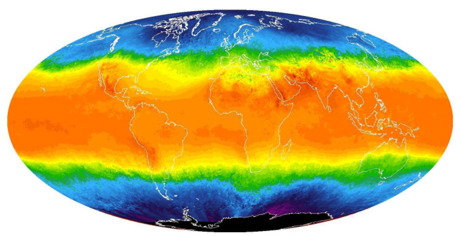

# udacity-dand-projects

This repository contains the projects of the Udacity's [Data Analyst nanodegree](https://www.udacity.com/course/data-analyst-nanodegree--nd002) program.

* [Project 1: Explore Weather trends](p1_explore_weather_trends) is analyze local and global temperature data and compare the temperature trends where you live to overall global temperature trends.
 
